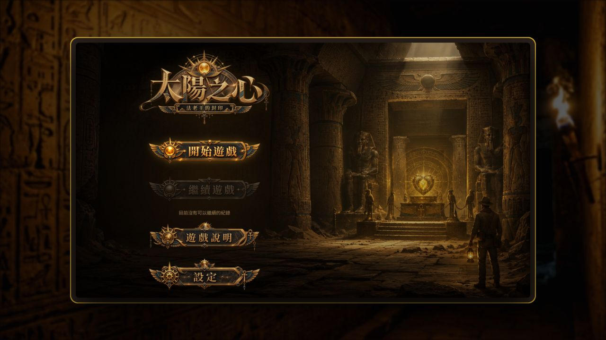
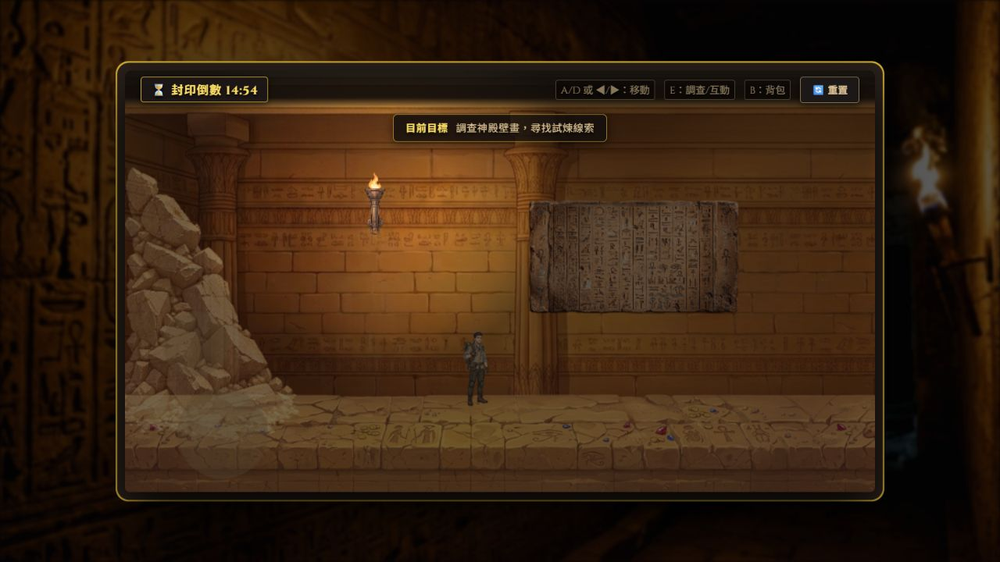
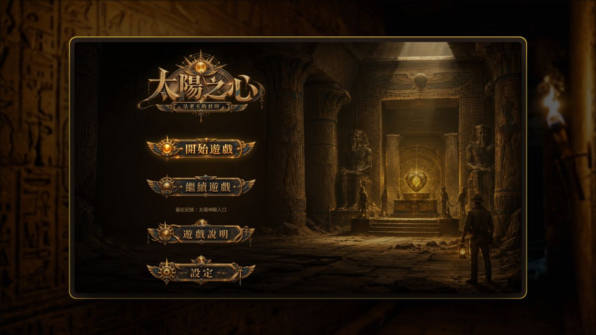

# 太陽之心 Heart of the Sun

以古埃及陵墓為背景的網頁解謎冒險遊戲，玩家透過探索場景、收集線索與操作機關推進故事。支援 Guest 遊玩，也可使用會員登入與 Cloud Save；會員驗證由 Supabase Auth 提供，遊戲存檔保存在 PostgreSQL。

**學習與求職作品 / Team Project · 兩人合作**

## 🎮 Live Demo

**[開始遊玩：https://sun-main.pages.dev](https://sun-main.pages.dev)**

可選擇「以訪客身分進入」直接體驗。本頁不提供共用測試帳號。

## 作品畫面

以下為公開 Live Demo 的 Guest 畫面，不含會員帳密。

### 主選單



### 遊戲探索



### 遊戲進度



## 主要功能

- **Guest 模式**：不必建立帳號即可遊玩，進度保存在目前瀏覽器。
- **Email / Password 登入**：登入後使用自己的會員存檔。
- **Session 狀態恢復**：重新開啟頁面時，恢復仍有效的登入狀態。
- **Cloud Save / Load**：會員可保存與讀取雲端遊戲進度。
- **F5 後恢復進度**：可從已保存的 checkpoint 繼續探索。
- **Guest → Member 匯入**：符合條件時，由玩家決定是否將訪客進度匯入會員存檔。
- **獨立會員存檔**：每位會員都有自己的遊戲紀錄。

## 團隊分工

本專案由劉祈慧與林宣伯兩人合作完成。

| 成員 | 主要負責內容 |
| --- | --- |
| 劉祈慧 | 前端介面、遊戲畫面、UI 與互動呈現，以及前端遊戲流程。 |
| 林宣伯 | Supabase Auth 登入與會員功能整合、PostgreSQL 遊戲存檔資料設計與串接、RLS 基本權限設定與使用者資料隔離、雲端存檔／讀檔與 Guest／會員存檔流程整合、前後端資料串接與功能測試，並協助正式環境部署與驗證。 |

## AI 協作

本專案開發過程使用 ChatGPT、Codex 等 AI 工具協助需求分析、程式實作與除錯。我（林宣伯）主要負責後端與資料庫功能規劃、整合、人工測試與結果驗證。

## 使用技術

| 類別 | 技術與工具 |
| --- | --- |
| 前端與遊戲 | HTML5、CSS3、JavaScript、Canvas |
| 開發與建置 | Vite |
| 登入與資料庫 | Supabase Auth、PostgreSQL、Row Level Security（RLS） |
| 部署 | Cloudflare Pages |
| 版本管理 | Git、GitHub |
| AI 協作工具 | ChatGPT、Codex |

## 架構與存檔流程

```text
Browser
  ↓
Cloudflare Pages
  ↓
Supabase Auth
  ↓
RLS
  ↓
PostgreSQL game_saves
```

上圖概括網站載入、會員驗證與資料存取的關係。Cloudflare Pages 提供靜態網站；遊戲載入 Browser 後，由前端連接 Supabase，資料讀寫再由 RLS 檢查權限。

遊戲使用 browser `localStorage` 保存本機進度，會員則透過 Supabase Cloud Save 保存雲端進度。存檔以 checkpoint 為單位，重新整理後可恢復最近已保存的紀錄。

Guest 已有進度、且登入的會員尚無 Cloud Save 時，可以選擇匯入 Guest 存檔。若會員已有 Cloud Save，系統不會自動用 Guest 進度覆蓋它。

### 資料與權限

- `game_saves.user_id` 對應 `auth.users.id`，每位會員對應一筆遊戲存檔。
- 使用 RLS 做資料隔離，會員只能讀寫自己的存檔。
- Browser 使用 Supabase **publishable key**，不使用 service-role 或 secret key。
- 本機環境設定與憑證不放入版本控制。

## 測試與驗證

以下整理已完成的驗證結果；本輪文件收尾不重新操作正式會員或雲端存檔。

| 項目 | 已驗證結果 |
| --- | --- |
| Full regression | 56 / 56 PASS |
| Auth negative tests | 19 / 19 PASS |
| Cloud negative tests | 23 / 23 PASS |
| Database / RLS pgTAP | 43 / 43 PASS，**Phase 2 已驗證** |
| Production build | PASS |
| Production Login / Cloud Save / Load | PASS |
| Guest / F5 restore | PASS |

pgTAP 結果來自 Phase 2；Final Audit 時本機沒有 Docker，未在 Final Phase 重新執行。自動化測試與資料庫驗證細節可參考 [Phase 2 紀錄](PHASE_2_REPORT.md) 與 [Phase 5A 紀錄](PHASE_5_REPORT.md)。這些文件保留各階段當時的狀態，包含後續已處理的部署待辦，不代表目前部署狀態。

## 部署方式

```text
GitHub
  ↓
Cloudflare Pages
  ↓
https://sun-main.pages.dev

Backend / Database：Supabase
```

Cloudflare Pages 從 GitHub 取得版本並建置，發布 `dist` 目錄。Supabase 提供會員驗證與資料庫服務。

## 本機啟動

使用 Node.js 22 或更新版本，在專案根目錄執行：

```bash
npm install
npm run dev
npm run build
```

請自行建立 `.env.local`，填入自己的 Supabase 專案設定；下方僅為空白 placeholder：

```dotenv
VITE_SUPABASE_URL=
VITE_SUPABASE_PUBLISHABLE_KEY=
```

會員與雲端存檔功能需要自己的 Supabase Auth、`game_saves` 資料表與 RLS 設定；資料結構可參考 [migration](supabase/migrations/20260903032810_create_game_saves.sql)。不要把 service-role 或 secret key 填入前端設定，也不要提交 `.env.local`。

## 操作方式

| 按鍵 | 操作 |
| --- | --- |
| A / D 或方向鍵左右 | 移動 |
| E | 調查／互動 |
| B | 開啟／關閉背包 |
| Esc | 關閉面板／跳過開場動畫 |
| E / 空白鍵 / Enter | 推進對話 |

## 延伸文件

- [後端架構與串接紀錄](BACKEND_ARCHITECTURE.md)
- [Cloud Save 整合紀錄](PHASE_4_REPORT.md)
- [遊戲需求文件](docs/PRD%20產品需求文件.md)
- [v1.0.0 Release Notes](docs/releases/v1.0.0.md)
